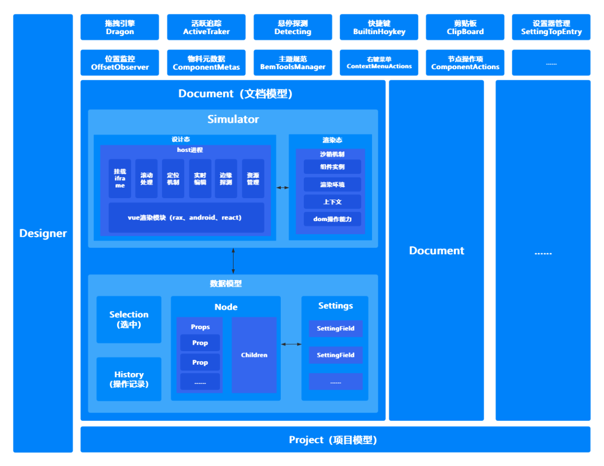

# 编排模块

## 概念

编排是一个将设计器中的各个物料（组件）通过拖拽、配置和组织，转化为可执行业务逻辑的schema描述的过程。它包含三个主要方面：

1. 布局设置
2. 组件设置
3. 交互设置（js/逻辑编排）

## 编排的本质

**编排本质上既是生产符合页面搭建协议的数据**，在这个场景里，协议是通过 JSON 来承载的。如：

```json
{
  "componentName": "Page",
  "id": "node_dockyesh01",
  "props": {
    "style": {
          "height": "100%"
     }
  },
  "children": [
    {
      "componentName": "Button",
      "props": {
        "size": "large"
      }
    }
  ]
  // 更多属性
  ......
}
```

所以我们需要设计一个模块来对这个抽象的dom结构进行CRUD，从而实现复杂的页面的编排。为了更好的生产协议我们设计很多功能来辅助我更好的完成编排。如：

1. 项目模型、文档模型、节点模型、属性模型；
2. 拖拽和定位
3. 交互设计
4. 快捷键
5. 历史记录
6. 入料/出码
7. 编辑

## 架构设计

编排模块采用面向对象的设计思想，将复杂的页面搭建过程抽象为一系列清晰的对象模型，实现了对组件布局、属性配置和交互行为的统一管理。整体框架如下图所示：

## 模型设计

### Designer