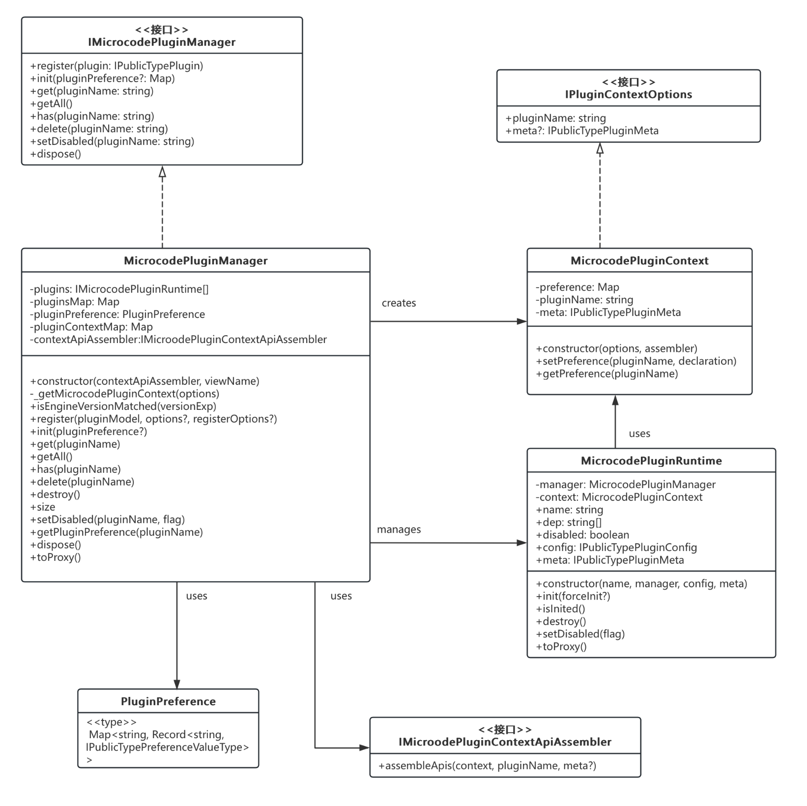

# 插件机制

## 设计背景与目标

### 背景

低代码平台需要解决以下核心问题：

- 功能模块的扩展性
- 模块间的解耦
- 第三方集成
- 定制化需求
- 维护性与稳定性

### 设计目标

- 可扩展性：支持功能模块的即插即用
- 低耦合：模块间通过统一接口通信
- 高稳定：插件运行时隔离
- 易维护：完整的生命周期管理
- 灵活性：支持动态加载和配置化

### 优势

架构扩展性：低代码平台需要支持大量功能模块（如物料、画布、设置器等），这些功能可能来自不同团队，甚至是第三方开发者。插件机制提供了一个标准化的方式来扩展平台能力，使得新功能可以被轻松集成，而无需修改核心代码。

 解耦与维护性：通过插件机制，各个功能模块之间通过统一的上下文（PluginContext）进行通信，而不是直接相互依赖。这种松耦合的设计大大降低了代码的维护难度，当某个模块需要更新时，不会影响其他模块的正常运行。

定制化需求：不同的客户可能需要不同的功能组合。插件机制允许我们根据客户需求动态组装功能模块，实现产品的差异化配置。同时，客户也可以基于插件机制开发自己的定制功能。

性能优化：插件的按需加载机制确保了只有必要的功能才会被加载，避免了不必要的资源消耗。同时，插件的生命周期管理也使得资源能够被合理地释放。

生态建设：标准化的插件接口为建立开发者生态提供了基础。第三方开发者可以遵循统一的规范开发插件，并通过插件市场共享给其他用户，促进生态的繁荣发展。

错误隔离：每个插件都运行在独立的上下文中，一个插件的错误不会影响其他插件的正常运行，这大大提高了平台的稳定性。

版本管理：插件机制内置了版本控制能力，可以确保插件与平台核心的版本兼容性，避免因版本不匹配导致的问题。

这种机制不仅解决了当前的技术需求，也为未来的扩展提供了可能性，如微前端集成、云端插件等高级特性的支持。总的来说，插件机制是构建可扩展、可维护、可定制的低代码平台的最佳选择之一。

## 整体架构

### 核心组件



### 核心类和接口

- IMicrocodePluginManager: 插件管理器接口
- MicrocodePluginManager: 具体实现类
- MicrocodePluginContext: 插件上下文类
- MicrocodePluginRuntime: 插件运行时类

### 关键属性

- plugins: 插件实例数组
- pluginsMap: 插件实例映射
- pluginPreference: 插件偏好设置
- pluginContextMap: 上下文映射

### 重要方法

- register(): 注册插件
- init(): 初始化插件
- destroy(): 销毁插件
- toProxy(): 创建代理

### 关联关系

- Manager 创建和管理 Context
- Manager 管理 Runtime
- Runtime 使用 Context

### 辅助类型

- PluginPreference: 插件偏好设置类型
- IPluginContextOptions: 上下文选项接口
- IMicroodePluginContextApiAssembler: API组装器接口

这个类图清晰地展示了插件系统的核心架构和各组件之间的关系。每个类都有其明确的职责：MicrocodePluginManager 负责整体管理MicrocodePluginContext 提供运行环境MicrocodePluginRuntime 处理具体插件实例这种设计实现了关注点分离。

## 核心概念

### 插件定义

插件定义的核心是`IPublicTypePlugin`接口

```typescript
export type IPublicTypePluginCreater = (
	ctx: IPublicModelPluginContext,
	options: any
) => IPublicTypePluginConfig;

/**
 * 描述插件的配置结构
 */
export interface IPublicTypePlugin extends IPublicTypePluginCreater {
	/**
	 * 插件名称
	 */
	pluginName: string;

	/**
	 * 插件配置声明信息
	 */
	meta?: IPublicTypePluginMeta;
}


```

插件的生命周期

```typescript
/**
 * 插件配置接口
 */
export interface IPublicTypePluginConfig {
	/**
	 * 初始化插件
	 * @returns 返回一个 Promise 或者 void
	 */
	init(): Promise<void> | void;

	/**
	 * 销毁插件
	 * 可选方法
	 * @returns 返回一个 Promise 或者 void
	 */
	destroy?(): Promise<void> | void;

	/**
	 * 导出插件的内容
	 * 可选方法
	 * @returns 返回任意类型的内容
	 */
	exports?(): any;
}

```

## 详细设计

### 插件注册机制

```typescript
// 声明插件  
const demoPlugin = (ctx: any, option: any) => ({
	init() {
		console.log(ctx); // 插件管理的组件上下文
		console.log(option); // 返回自定义的配置声明
		// 初始化逻辑
	},
	destroy() {
		// 清理逻辑
	},
});
demoPlugin.pluginName = 'demoPlugin';
demoPlugin.meta = {
	// 定义插件所依赖的其他插件，如果插件有依赖项加载时会按照依赖顺利进行初始化
	dependencies: ['otherPlugin'],
	engines: {
		// 制定插件与哪个版本的引擎兼容
		microcodeEngine: '1.0.0',
	},
	// 指定插件的事件前缀。如果未设置，会默认为 'common'，建议使用插件名称作为事件前缀。
	eventPrefix: 'demo',
	// 定义插件的命令作用域（commandScope）。当插件需要注册命令时，必须在 meta 中定义 commandScope
	commandScope: 'demoPlugin',
	// 定义插件的配置声明，用于配置插件的用户偏好项
	preferenceDeclaration: {
		title: '自定义配置',
		properties: [
			{
				key: 'testField',
				type: 'string',
				description: '用于测试',
			},
		],
	},
};

// 注册插件
plugins.register(demoPlugin,{
  testField:'测试数据'
})

// 全局设置偏好
const preference = new Map();
preference.set('demoPlugin', {
	testField: '01010101',
});

// 插件初始化
plugins.init(pluginPreference);
```

### 引擎上下文

```typescript
const pluginContextApiAssembler: IMicroodePluginContextApiAssembler = {
	assembleApis(
		context: IMicrocodeContextPrivate,
		pluginName: string,
		meta: IPublicTypePluginMeta
	) {
    // 注册整个引擎的上下文供每个插件使用
		context.skeleton = new Skeleton(innerSkeleton, pluginName, false);
		context.plugins = plugins;
		context.setters = setters;
		context.config = config;
		context.material = material;
		context.canvas = canvas;
		context.project = project;
		const eventPrefix = meta?.eventPrefix || 'common';
		context.event = new Event(commonEvent, { prefix: eventPrefix });
		context.logger = new Logger({
			level: 'warn',
			bizName: `plugin:${pluginName}`,
		});
		editor.set('pluginContext', context);
	},
};

const innerPlugins = new MicrocodePluginManager(pluginContextApiAssembler);
// face模式，实际上是innerPlugins来完成核心的逻辑
const plugins: Plugins = new Plugins(innerPlugins).toProxy();
```

- 快捷键功能
- 项目管理
- 项目布局
- 设置器注册
- 物料注册
- 事件系统
- 配置管理
- 通用功能
- 拖拽引擎
- 插件管理
- 日志系统
- 命令系统
- 通用的UI组件

以上这些能力都是在引擎内部实现的，通过插件机制和face设计模式暴露出来给开发者使用，扩展性强大，插件功能之间独立，错误不会互相影响，具有很强的隔离性。同时具备标准化的注册，统一的接口定义方便开发者使用。

引擎本身只包含了最小的内核，而我们所能看到的设计器上的按钮、面板等都是插件提供的。插件是组成设计器的必要部分。因此我后续会提供了一套插件生态，提供最基础的设计器功能。帮助用户通过使用插件，快速完成自己的设计器。


