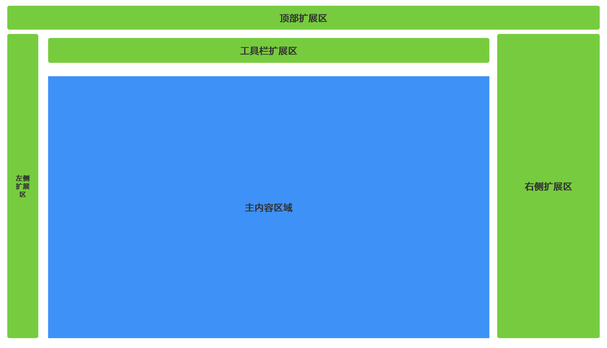
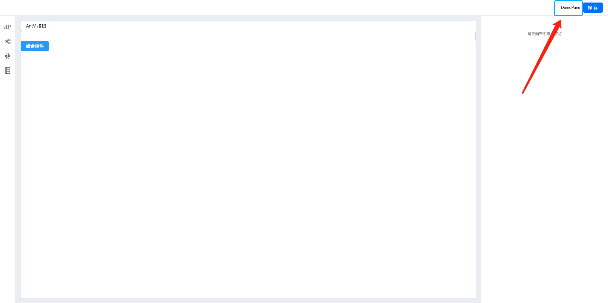
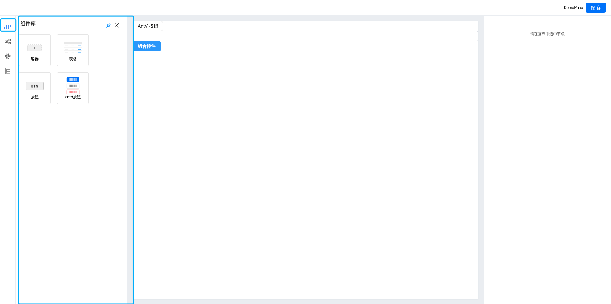
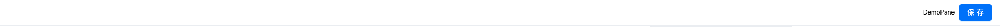
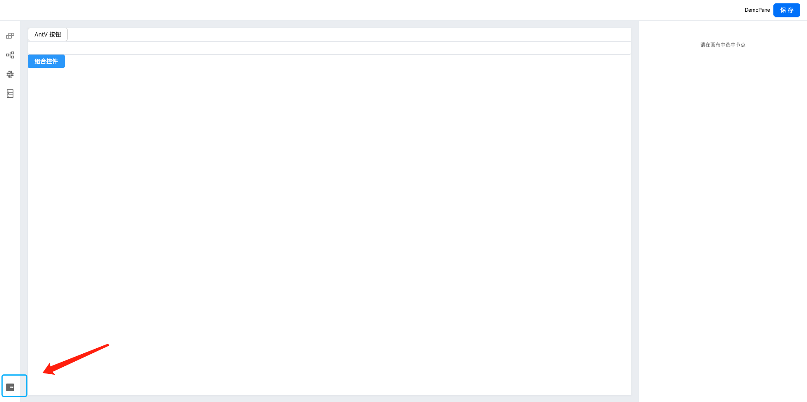

# 面板扩展

## 插件-面板

插件机制赋予了引擎更高的灵活性，引擎的后期会提供了一些插件，但是无法满足所有人的需求，所以提供了强大的插件定制功能。通过定制插件，在和引擎解耦的基础上，我们可以和引擎核心模块进行交互，从而满足多样化的功能。不仅可以自定义插件的 UI，还可以实现一些非 UI 的逻辑：

1. 调用编辑器框架提供的 API 进行编辑器操作或者 schema 操作；
2. 通过插件类的生命周期函数实现一些插件初始化的逻辑；
3. 通过实现监听编辑器内的消息实现特定的切片逻辑（例如面板打开、面板关闭等）；

> 本文仅介绍面板的实现原理和如何扩展，编辑器插件层面的扩展可以参考本章节。

## 结构

面板是作用于设计器的，主要是通过按钮、图标等展示在设计器的骨架中。设计器的骨架我们分为下面的几个区域，而我们的插件大多数都是作用于这几个区域的。 



## 如何使用

### 注册

使用插件机制来注册面板，效果如图：

```tsx
const demoPlugin = (ctx: IPublicModelPluginContext, options: any) => ({
	init() {
		const { skeleton } = ctx;
		skeleton.add({
			name: 'DemoSkeleton',
			area: 'topArea',
			type: 'Widget',
			content:<div>DemoPane</div>,
		});
	},
});
demoPlugin.pluginName = 'DemoPlugin';
```



### 展示区域

展示区域分为`topArea`、`leftArea`、`centerArea`、`rightArea`、`toolbar`这些区域，每个区域可以根据自己的产品来规划具体的功能。

### 展示形式

#### PanelDock

PanelDock 是以面板的形式展示在设计器的左侧区域的。其中主要有两个部分组成，一个是图标，一个是面板。当点击图标时可以控制面板的显示和隐藏。



```tsx
skeleton.add({
			name: 'leftArea-PaneDock-2',
			area: 'leftArea',
			type: 'PanelDock',
  		// 设置图标的属性
			props: {
				align: 'top',
				icon: <SlackOutlined />,
				description: '组件库',
			},
  		// 面板包含的内容组件
			content: <ComponentPane></ComponentPane>,
  		// 设置面板的属性
			panelProps: {
				title: '组件',
			},
		});
```

可设置属性

```typescript
{
  type: 'PanelDock',
  
  // 面板属性
  panelProps?: {
    hideTitleBar?: boolean;    // 是否隐藏标题栏
    width?: number;            // 面板宽度
    height?: number;           // 面板高度
    maxWidth?: number;         // 最大宽度
    maxHeight?: number;        // 最大高度
    area?: string;            // 面板区域
  },
  
  // 图标和交互属性
  props?: {
    size?: 'small' | 'medium' | 'large';  // 尺寸
    className?: string;                    // 自定义类名
    description?: string | VNode;          // 描述文本
    onClick?: () => void;                  // 点击回调
    icon?: string | VNode;                // 图标
    title?: string | VNode;               // 标题
  }
}
```


#### Widget

Widget 形式是直接渲染在当前编辑器的对应位置上。如 demo 中在设计器顶部的所有组件都是这种展现形式。



```tsx
skeleton.add({
			name: 'topArea-widget-right',
			area: 'topArea',
			type: 'Widget',
			content: (
				<Button
					type={'primary'}
					onClick={() => {
						console.log(project.exportSchema(IPublicEnumTransformStage.Save));
					}}
				>
					保存
				</Button>
			),
		});
```

可设置属性

```typescript
{
  props: {
    icon:  any;              // 图标
    align?: 'top' | 'bottom'｜'left'｜'right'|'center';            // 对齐方式
    onClick?: () => void;                 // 点击回调
  }
}
```

#### 

#### Dock

一个图标的表现形式，可以用于语言切换、跳转到外部链接、打开一个 widget 等场景。



```tsx
skeleton.add({
			area: 'leftArea',
			type: 'Dock',
			name: 'opener',
			props: {
				icon: <WalletFilled />, // Icon 组件实例
				align: 'bottom',
				onClick() {
					// 打开外部链接
					window.open('http://www.ltscm.com.cn/');
				},
			},
		});
```

可设置属性

```typescript
{
  props: {
    icon: any;              // 图标
    align?: 'top' | 'bottom'｜'left'｜'right'|'center';            // 对齐方式
    onClick?: () => void;                 // 点击回调
  }
}
```

#### Panel

一般不建议单独使用，通过 PanelDock 使用

#### 基础配置

所有类型的组件都支持以下基础配置

```typescript

{
  // 组件唯一标识名称（必填）
  name: string;
  
  // 组件类型（必填）
  type: 'Panel' | 'PanelDock' | 'Widget' | 'Dock';
  
  // 组件停靠区域
  area: 'topArea' | 'leftArea' | 'centerArea' | 'rightArea' | 'toolbar';
  
  // 组件内容
  content?: string | VNode | Component | IPublicTypePanelConfig[];
  
  // 内容属性
  contentProps?: Record<string, any>;
  
  // 组件排序优先级，数值越小越靠前
  index?: number;
  
  // 组件属性
  props?: Record<string, any>;
}
```

